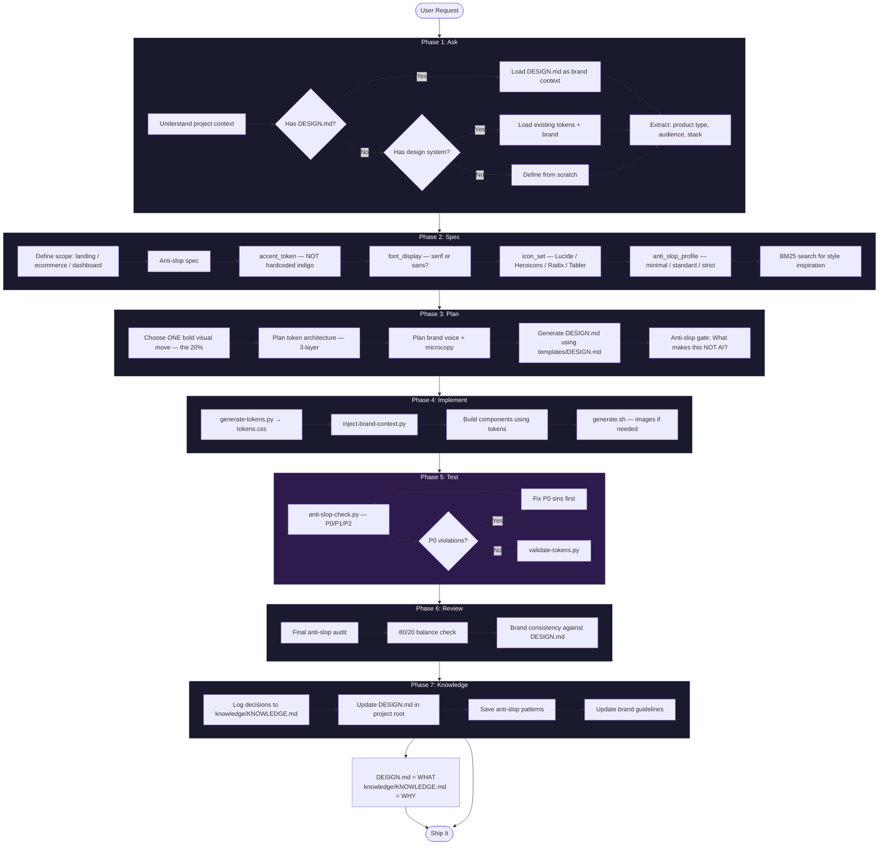
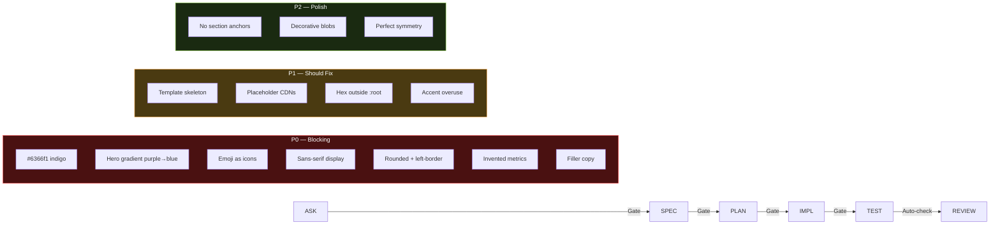
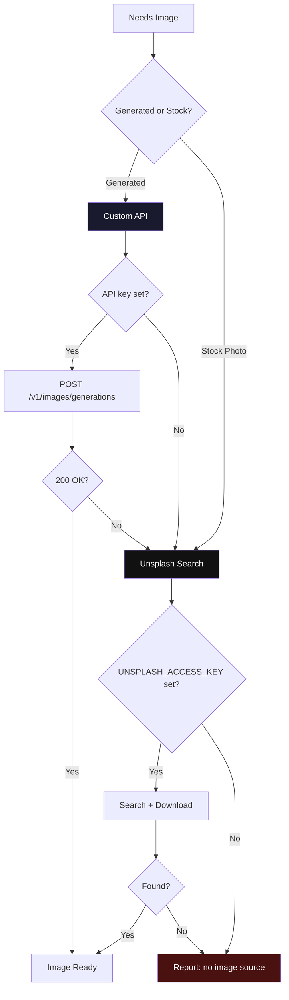

# UI/UX Methodology (uiux-meth)


> Anti-slop design intelligence + dev-methodology workflow for frontend UI.

Design and ship frontend interfaces that look intentional, not templated. Covers landing pages, ecommerce, dashboards, and marketing pages across all frontend stacks. Actively avoids "AI slop" (default Tailwind indigo, two-stop hero gradients, emoji icons, filler copy, fake metrics, rounded left-border cards).

Combines **5 design domains** into one unified workflow with **anti-slop quality gates** at every phase.

---

## Table of Contents

- [What It Is](#what-it-is)
- [Install](#install)
- [Setup (API Keys)](#setup-api-keys)
- [Workflow](#workflow)
- [The Seven Cardinal Sins](#the-seven-cardinal-sins)
- [Scripts](#scripts)
- [Data Files](#data-files)
- [Design Dials](#design-dials)
- [Pre-Ship Checklist](#pre-ship-checklist)
- [License](#license)

---

## What It Is

| Capability | What It Does |
|---|---|
| **Design Intelligence** | BM25 search across 84 styles, 192 product types, 192 palettes, 74 font pairings, 98 UX rules |
| **Design System** | 3-layer token architecture (global → alias → component), auto-generate + validate |
| **Brand Identity** | Voice, messaging, visual language extraction from brand guidelines |
| **Banner Design** | Image generation with anti-slop prompts + Unsplash fallback |
| **Anti-Slop Validation** | 13 automated checks (P0/P1/P2) to catch AI-generated boilerplate |

---

## Install

### Option A: Global (shared — all agents)

`~/.agents/skills/` adalah direktori shared. Semua agent (Pi, OpenClaw, dll) pakai path ini.

```bash
mkdir -p ~/.agents/skills
cp -r uiux-methodology ~/.agents/skills/
```

### Option B: Per-Project

Available only to a specific project.

```bash
# From your project root
mkdir -p .openclaw/skills
cp -r /path/to/uiux-methodology .openclaw/skills/

# Project structure:
my-project/
├── .openclaw/
│   └── skills/
│       └── uiux-methodology/
│           ├── SKILL.md
│           ├── scripts/
│           ├── data/
│           └── ...
├── .env                          # your API keys
└── src/
```

### Option C: Manual Copy

Copy files directly into your agent's skill folder.

```
~/.openclaw/workspace/skills/
└── uiux-methodology/
    ├── SKILL.md
    ├── .env.example
    ├── scripts/
    ├── data/
    ├── references/
    └── templates/
```

### Verify Installation

```bash
# Test BM25 search
python3 scripts/search.py "saas dark minimal" --design-system -p "Test"

# Test anti-slop checker
python3 scripts/anti-slop-check.py --help

# Test token generator
python3 scripts/generate-tokens.py --accent "#1a1a2e" --output /tmp/test.css
```

---

## Setup (API Keys)

### Unsplash (Free)

Used as fallback image source when custom API is unavailable.

1. Go to [unsplash.com/developers](https://unsplash.com/developers)
2. Click **"Register as a developer"**
3. Log in or create an Unsplash account
4. Go to [unsplash.com/oauth/applications](https://unsplash.com/oauth/applications)
5. Click **"New Application"** — read and accept the terms
6. Name your application (e.g. `uiux-methodology`)
7. After creation, you'll see:
   - **Access Key** → this is your `UNSPLASH_ACCESS_KEY`
   - **Secret Key** → not needed for this skill
8. Copy the Access Key

> **Free tier:** 1,000 requests/hour, no credit card required.

### Custom Image API (Optional)

OpenAI-compatible image generation endpoint (`POST /v1/images/generations`). Supports any provider that implements this API format (OpenAI, Replicate, local models, etc.).

### Configure .env

```bash
# From skill directory
cp .env.example .env
```

Edit `.env`:

```env
# Unsplash (required for image fallback)
UNSPLASH_ACCESS_KEY=your-access-key-here

# Custom image API (optional — skip if not needed)
# MY_IMAGE_API_KEY=your-api-key
# MY_IMAGE_API_URL=https://your-provider.com/v1/images/generations
# MY_IMAGE_API_TIMEOUT=60
```

### .env Search Order

The scripts look for `.env` in this order (stops at first found):

| Priority | Location | Use Case |
|---|---|---|
| 1 | `SKILL_ENV_FILE` env var | Explicit override |
| 2 | Project root `.env` | Per-project keys (different projects, different keys) |
| 3 | Skill directory `.env` | Global fallback |

### Security

Add `.env` to `.gitignore`:

```gitignore
.env
```

---

## Workflow

The skill follows **dev-methodology** as its backbone, with **anti-slop quality gates** at every phase.

### Overview



### Anti-Slop Gates per Phase



### Image Generation Flow



---

## The Seven Cardinal Sins

P0 — must fix before shipping:

| # | Sin | Detection | Fix |
|---|-----|-----------|-----|
| 1 | Default Tailwind indigo (`#6366f1`) | `grep -rn '#6366f1\|#4f46e5\|#8b5cf6'` | Use `--accent` token |
| 2 | Two-stop hero gradient | `linear-gradient` with purple/blue/cyan | Flat surface + type |
| 3 | Emoji as feature icons | Emoji in h*, button, aria-label | SVG (Lucide/Heroicons) |
| 4 | Sans-serif on display headings | `font-family: Inter` on h1/h2 | `var(--font-display)` |
| 5 | Rounded card + left-border | `border-left` + `border-radius` | Drop one |
| 6 | Invented metrics | "10× faster", "99.9%" | Real data or placeholder |
| 7 | Filler copy | "lorem ipsum", "feature one" | Real microcopy |

---

## Scripts

### BM25 Design Search

```bash
python3 scripts/search.py "saas dark minimal" --design-system -p "MyApp"
python3 scripts/search.py "glassmorphism" --domain style
python3 scripts/search.py "dashboard" --domain chart --variance 3 --density 8
```

| Flag | Description |
|---|---|
| `--design-system` | Full design system output |
| `-p "Name"` | Project name |
| `--domain <type>` | Restrict: product, style, color, typography, ux, landing, chart, gsap, icons |
| `--variance 1-10` | Boldness: 1=minimal, 10=bold |
| `--motion 1-10` | Animation: 1=subtle, 10=complex |
| `--density 1-10` | Spacing: 1=spacious, 10=dense |
| `--persist` | Save to project root |
| `--output-dir` | Where to save |

### Anti-Slop Check

```bash
python3 scripts/anti-slop-check.py ./src
python3 scripts/anti-slop-check.py ./src --profile strict --format json
python3 scripts/anti-slop-check.py ./src --profile minimal
```

| Profile | Checks |
|---|---|
| `minimal` | P0 only (blocking) |
| `standard` | P0 + P1 (default) |
| `strict` | P0 + P1 + P2 |

Exit code: `0` = no P0, `1` = P0 found (fix first).

### Token Generator

```bash
python3 scripts/generate-tokens.py \
  --accent "#1a1a2e" \
  --font-display "Playfair Display" \
  --font-body "Inter" \
  --output tokens.css
```

### Token Validator

```bash
python3 scripts/validate-tokens.py tokens.css
```

### Brand Context Injector

```bash
python3 scripts/inject-brand-context.py \
  --brand docs/brand-guidelines.md \
  --output brand-context.md
```

### Image Generation

```bash
# Custom API
./scripts/generate.sh "Editorial photo of a minimalist desk setup, soft window light, no text" chatgpt-web 1 1024x1024 high png

# Parameters: PROMPT [model] [n] [size] [quality] [format]
```

| Param | Default | Options |
|---|---|---|
| `PROMPT` | *(required)* | Art-direction prose |
| `model` | `chatgpt-web` | Any model identifier |
| `n` | `1` | 1–10 |
| `size` | `auto` | `auto`, `1024x1024`, `1024x1536`, `1536x1024` |
| `quality` | `auto` | `auto`, `low`, `medium`, `high` |
| `format` | `png` | `png`, `jpg`, `jpeg`, `webp` |

---

## Data Files

| File | Records | Description |
|---|---|---|
| `product-types.csv` | 192 | Product type profiles (SaaS, ecommerce, fintech, etc.) |
| `ui-styles.csv` | 84 | UI style profiles (glassmorphism, brutalist, minimal, etc.) |
| `color-palettes.csv` | 192 | Palette recommendations per mood/industry |
| `font-pairings.csv` | 74 | Typography pairings (display + body) |
| `landing-patterns.csv` | 34 | Landing page section structures |
| `ux-guidelines.csv` | 98 | UX rules across 22 tech stacks |
| `chart-types.csv` | 25 | Chart/data visualization recommendations |
| `gsap-presets.csv` | 16 | GSAP animation presets |

---

## Design Dials

Three 1-10 sliders to tune output:

| Dial | 1-3 | 4-7 | 8-10 |
|---|---|---|---|
| `--variance` | Centered/minimal | Balanced | Bold/asymmetric |
| `--motion` | Subtle micro-interactions | Standard scroll/stagger | Complex choreography |
| `--density` | Spacious (24-96px) | Standard (16-64px) | Dense/dashboard (8-32px) |

---

## Pre-Ship Checklist

```markdown
- [ ] cursor-pointer on all clickable elements
- [ ] Hover states with smooth transitions (150-300ms)
- [ ] Text contrast 4.5:1 minimum (WCAG AA)
- [ ] Focus states visible for keyboard navigation
- [ ] prefers-reduced-motion respected
- [ ] Responsive: 375px, 768px, 1024px, 1440px
- [ ] No hardcoded colors (all via design tokens)
- [ ] SVG icons only (no emoji as icons)
- [ ] Min touch target 44×44px
- [ ] Error messages near relevant fields
- [ ] No P0 cardinal sins present
- [ ] No P1 soft tells present
- [ ] Brand voice consistent across copy
- [ ] Accent token used, not hardcoded indigo
- [ ] Display font loaded and applied via tokens
```

---

## Project Structure

```
uiux-methodology/
├── SKILL.md                              # Core skill doc + workflow
├── README.md                             # This file
├── LICENSE                               # MIT
├── .env.example                          # API key template
├── scripts/
│   ├── search.py                         # BM25 design search engine
│   ├── anti-slop-check.py                # Automated anti-slop validator
│   ├── generate.sh                       # Image generation (API + Unsplash)
│   ├── generate-tokens.py                # Design token generator
│   ├── validate-tokens.py                # Token validator
│   └── inject-brand-context.py           # Brand context extractor
├── data/
│   ├── product-types.csv
│   ├── ui-styles.csv
│   ├── color-palettes.csv
│   ├── font-pairings.csv
│   ├── landing-patterns.csv
│   ├── ux-guidelines.csv
│   ├── chart-types.csv
│   └── gsap-presets.csv
├── references/
│   ├── quick-reference.md
│   ├── pro-rules.md
│   ├── component-specs.md
│   ├── token-architecture.md
│   └── anti-slop-rules.md
└── templates/
    ├── DESIGN.md                        # Design system doc for AI agents
    ├── brand-guidelines-starter.md
    ├── design-tokens-starter.json
    └── anti-slop-checklist.md
```

---

## Priority Rules

1. Anti-slop P0 sins override everything — always fix first
2. Brand guidelines override design search results
3. Existing project design system overrides skill recommendations
4. Token architecture enforces consistency
5. User preference overrides all defaults

---

## License

MIT License

Copyright (c) 2026 ardith666

Permission is hereby granted, free of charge, to any person obtaining a copy
of this software and associated documentation files (the "Software"), to deal
in the Software without restriction, including without limitation the rights
to use, copy, modify, merge, publish, distribute, sublicense, and/or sell
copies of the Software, and to permit persons to whom the Software is
furnished to do so, subject to the following conditions:

The above copyright notice and this permission notice shall be included in all
copies or substantial portions of the Software.

THE SOFTWARE IS PROVIDED "AS IS", WITHOUT WARRANTY OF ANY KIND, EXPRESS OR
IMPLIED, INCLUDING BUT NOT LIMITED TO THE WARRANTIES OF MERCHANTABILITY,
FITNESS FOR A PARTICULAR PURPOSE AND NONINFRINGEMENT. IN NO EVENT SHALL THE
AUTHORS OR COPYRIGHT HOLDERS BE LIABLE FOR ANY CLAIM, DAMAGES OR OTHER
LIABILITY, WHETHER IN AN ACTION OF CONTRACT, TORT OR OTHERWISE, ARISING FROM,
OUT OF OR IN CONNECTION WITH THE SOFTWARE OR THE USE OR OTHER DEALINGS IN THE
SOFTWARE.
